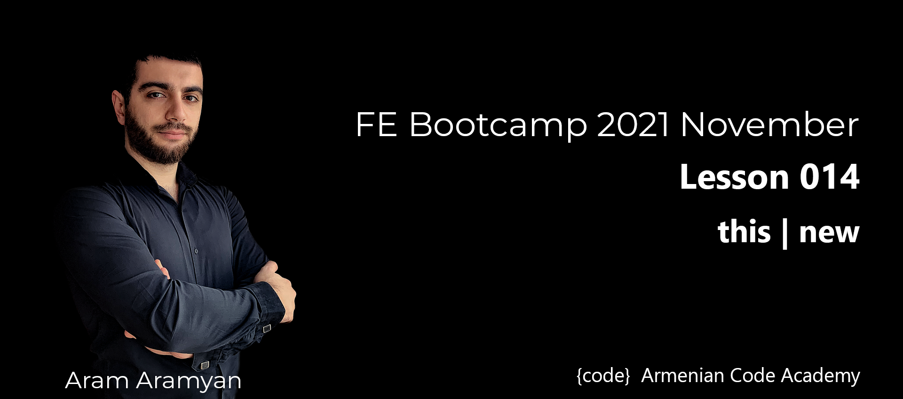

---
# this |  new

### **Calculator Constructor**
#### ***Create functions for the Calculator class that can do the following:***
* Add two numbers.
* Subtract two numbers.
* Multiply two numbers.
* Divide two numbers.

```javascript
const calculator = new Calculator();

calculator.add(10, 5);
calculator.subtract(10, 5);
calculator.multiply(10, 5);
calculator.divide(10, 5);
```

[**SOLUTION**](calculator.js)
___

### **Person**
#### ***Create a method in the Person class which returns how another person's age compares. Given the instances p1, p2 and p3, which will be initialised with the attributes name and age, return a sentence in the following format:***

***{other person name} is {older than / younger than / the same age as} me.***

```js
const p1 = Person("Samuel", 24)
const p2 = Person("Joel", 36)
const p3 = Person("Lily", 24)

p1.compareAge(p2); //"Joel is older than me."
p2.compareAge(p1); //"Samuel is younger than me."
p1.compareAge(p3); //"Lily is the same age as me."
```

[**SOLUTION**](person.js)
___

### **Person Constructor**
#### ***Write a Person Constructor that initializes name and age from arguments.***

* All instances of Person should initialize with an empty stomach array.
* Give instances of Person the ability to .eat("someFood") :
* When eating an edible, it should be pushed into the stomach .
* The eat method should have no effect if there are 10 items in the stomach .
* Give instances of Person the ability to .poop() :
* When an instance poops, its stomach should empty.
* Give instances of Person a method .toString() :
* It should return a string with name and age . Example: "Mary, 50"

[**SOLUTION**](personConstructor.js)
___

### **Car Constructor**
#### ***Write a Car constructor that initializes model and milesPerGallon from arguments.***
* All instances built with Car:
  * should initialize with an tank at 0
  * should initialize with an odometer at 0
* Give cars the ability to get fueled with a .fill(gallons) method. Add the gallons to tank. 
* **STRETCH:** Give cars ability to .drive(distance) . The
  distance driven:
* Should cause the odometer to go up.
* Should cause the the tank to go down taking milesPerGallon into account.
* **STRETCH:** A car which runs out of fuel while driving can't drive any more distance:
* The drive method should return a string "I ran out of fuel at x miles!" x being odometer.

[**SOLUTION**](carConstructor.js)
___

### **Baby Constructor**
#### ***Write a Baby constructor subclassing Person.***
* Besides name and age , Baby takes a third argument to initialize favoriteToy .
* Besides the methods on Person.prototype, babies have the ability to .play() :
* Should return a string "Playing with x", x being the favorite toy.

[**SOLUTION**](babyConstructor.js)
___

### **Playlist**
#### ***Create Playlist constructor.***
* Add: Pushes the passed-through song to the songs array
* Play: Plays current song based on array index
* Stop: Holds place in array, but calls above stop song prototype function
* Next: Sets the next song in the songs array, calling the above play prototype function
* Song should take in two arguments, title and artist, which should both be added as properties when the Song constructor function is used.
* Play: Sets the song as playing using isPlaying
* Stop: Sets the song as not playing (isPlaying = false)

```js
const playlist = new Playlist();
const heyJude  = new Song("Hey Jude", "The Beatles");
const jaded    = new Song("Jaded", "Aerosmith");

playlist.add(heyJude);
playlist.add(jaded);
playlist.play(); // Hey Jude started to play
playlist.next(); // Hey Jude stopped, Jaded started
playlist.next(); // Jaded stopped, Hey Jude started
playlist.stop(); // Hey Jude stopped
playlist.play(); // Hey Jude started
```

[**SOLUTION**](playlist.js)
___